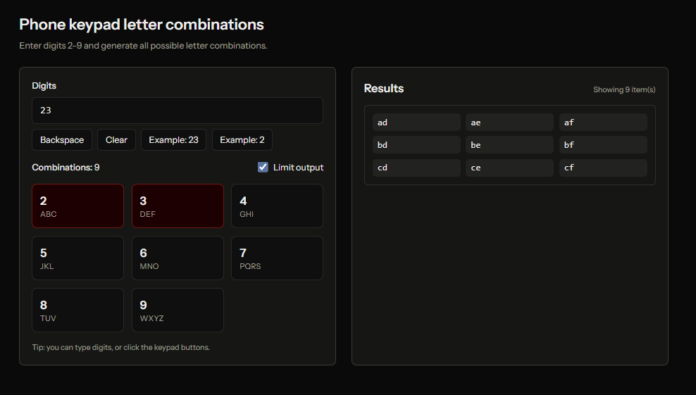

# Employee REST API (Laravel 12 + Sanctum)

A secure RESTful API built with **Laravel 12** that provides full CRUD operations for **Employees**.

- Auth: **Laravel Sanctum** personal access tokens (Bearer tokens)
- CRUD: `employees` resource endpoints
- Sample data: **100 employees** generated via seeder

## Requirements

- PHP **8.2+**
- Composer
- One of the following databases:
    - MariaDB/MySQL

## Setup

From the project root:

```bash
composer install
cp .env.example .env
php artisan key:generate
```

### Database configuration

**MariaDB/MySQL**

```env
DB_CONNECTION=mariadb
DB_HOST=127.0.0.1
DB_PORT=3306
DB_DATABASE=restful_api_dev
DB_USERNAME=root
DB_PASSWORD=
```

## Migrate & Seed (includes 100 employees)

```bash
php artisan migrate:fresh --seed
```

What gets seeded:

- A default user:
    - Email: `test@example.com`
    - Password: `password`
- 100 employees via `EmployeeSeeder`

## Run the app

```bash
php artisan serve
```

Default URL: `http://localhost:8000`

## Authentication (Sanctum Tokens)

This API is protected using `auth:sanctum` for employee endpoints.

### 1) Create a token

`POST /api/auth/token`

```bash
curl -X POST "http://localhost:8000/api/auth/token" \
  -H "Accept: application/json" \
  -H "Content-Type: application/json" \
  -d '{
    "email": "test@example.com",
    "password": "password",
    "device_name": "postman"
  }'
```

Response:

```json
{
    "token": "<plain-text-token>",
    "token_type": "Bearer"
}
```

Notes:

- This endpoint is rate-limited: `throttle:10,1` (10 requests/minute).
- Invalid credentials return HTTP `422` with a validation-style error payload.

### 2) Use the token

Send the token on every request:

- Header: `Authorization: Bearer <token>`

### 3) Revoke current token (logout)

`DELETE /api/auth/token`

```bash
curl -X DELETE "http://localhost:8000/api/auth/token" \
  -H "Accept: application/json" \
  -H "Authorization: Bearer <token>"
```

Returns: HTTP `204 No Content`

## Employee Resource

### Database fields

Employees are stored in the `employees` table:

- `id` (auto)
- `employee_code` (string, unique)
- `first_name` (string)
- `last_name` (string)
- `email` (string, unique)
- `phone` (nullable string)
- `department` (string)
- `job_title` (string)
- `hire_date` (date)
- `salary` (nullable decimal(12,2))
- `status` (string: `active` or `inactive`, default `active`)
- timestamps

### JSON shape

Employee endpoints return data using `EmployeeResource`:

```json
{
    "data": {
        "id": 1,
        "employee_code": "EMP-000001",
        "first_name": "Jane",
        "last_name": "Doe",
        "email": "jane.doe@example.com",
        "phone": "+1 (555) 123-4567",
        "department": "Engineering",
        "job_title": "Software Engineer",
        "hire_date": "2024-01-01",
        "salary": "90000.00",
        "status": "active",
        "created_at": "2026-01-21T10:00:00.000000Z",
        "updated_at": "2026-01-21T10:00:00.000000Z"
    }
}
```

## Employee CRUD Endpoints (secured)

All employee endpoints require:

- `Authorization: Bearer <token>`
- `Accept: application/json`

### List employees

`GET /api/employees`

- Returns a paginated response (15 per page)

```bash
curl "http://localhost:8000/api/employees" \
  -H "Accept: application/json" \
  -H "Authorization: Bearer <token>"
```

### Create employee

`POST /api/employees`

Request body:

- `first_name` (required)
- `last_name` (required)
- `email` (required, unique, RFC email)
- `department` (required)
- `job_title` (required)
- `hire_date` (required, date)
- `phone` (optional)
- `salary` (optional, numeric, >= 0)
- `status` (optional: `active` or `inactive`; defaults to `active`)
- `employee_code` (optional; if omitted the API auto-generates `EMP-000001` style codes)

```bash
curl -X POST "http://localhost:8000/api/employees" \
  -H "Accept: application/json" \
  -H "Content-Type: application/json" \
  -H "Authorization: Bearer <token>" \
  -d '{
    "first_name": "Roy",
    "last_name": "Lance",
    "email": "roy.lance@example.com",
    "department": "Engineering",
    "job_title": "Software Engineer",
    "hire_date": "2024-01-01",
    "salary": 90000,
    "status": "active"
  }'
```

Returns: HTTP `201 Created`.

### Get a single employee

`GET /api/employees/{employee}`

```bash
curl "http://localhost:8000/api/employees/1" \
  -H "Accept: application/json" \
  -H "Authorization: Bearer <token>"
```

### Update employee

`PUT /api/employees/{employee}` or `PATCH /api/employees/{employee}`

All fields are optional on update; uniqueness rules ignore the current record.

```bash
curl -X PATCH "http://localhost:8000/api/employees/1" \
  -H "Accept: application/json" \
  -H "Content-Type: application/json" \
  -H "Authorization: Bearer <token>" \
  -d '{
    "job_title": "Senior Software Engineer",
    "status": "inactive"
  }'
```

### Delete employee

`DELETE /api/employees/{employee}`

```bash
curl -X DELETE "http://localhost:8000/api/employees/1" \
  -H "Accept: application/json" \
  -H "Authorization: Bearer <token>"
```

Returns: HTTP `204 No Content`.

## Error handling

Common responses:

- `401 Unauthorized` — missing/invalid token
- `404 Not Found` — employee id does not exist
- `422 Unprocessable Entity` — validation errors

Example validation response:

```json
{
    "message": "The given data was invalid.",
    "errors": {
        "email": ["The email has already been taken."]
    }
}
```

## Project layout (API-related)

- Routes: `routes/api.php`
- Controllers:
    - `app/Http/Controllers/Api/AuthTokenController.php`
    - `app/Http/Controllers/Api/EmployeeController.php`
- Requests:
    - `app/Http/Requests/StoreEmployeeRequest.php`
    - `app/Http/Requests/UpdateEmployeeRequest.php`
- Resource: `app/Http/Resources/EmployeeResource.php`
- Model: `app/Models/Employee.php`
- Migration: `database/migrations/*_create_employees_table.php`
- Seeders:
    - `database/seeders/EmployeeSeeder.php`
    - `database/seeders/DatabaseSeeder.php`

## Testing

This repo uses Pest.

```bash
php artisan test
```

API tests live in:

- `tests/Feature/Api/AuthTokenTest.php`
- `tests/Feature/Api/EmployeeCrudTest.php`

## Notes / Security

- Employee endpoints are protected by `auth:sanctum`.
- Tokens are created per user/device name; revoke the current token via `DELETE /api/auth/token`.

## Phone Combination Problem


